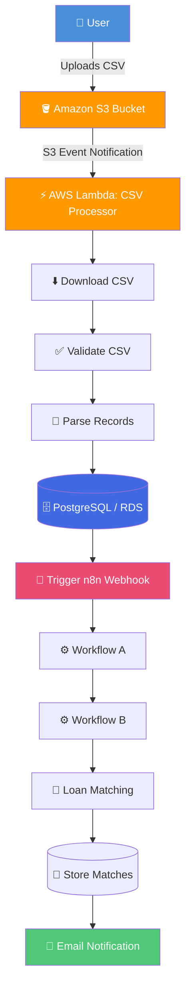
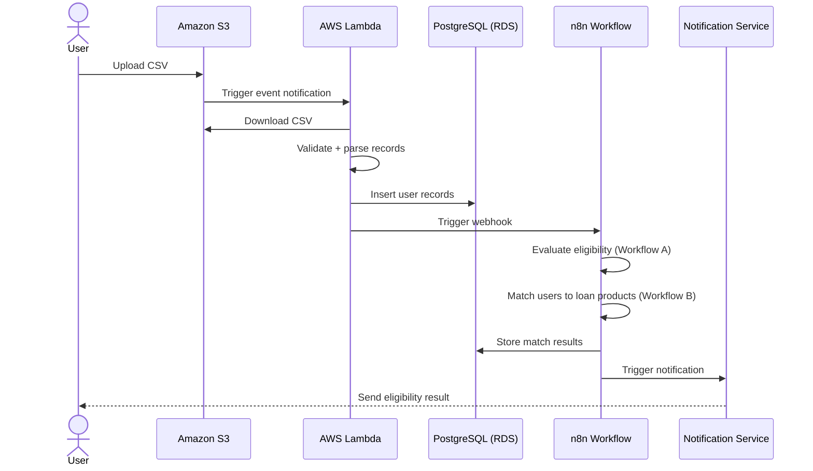
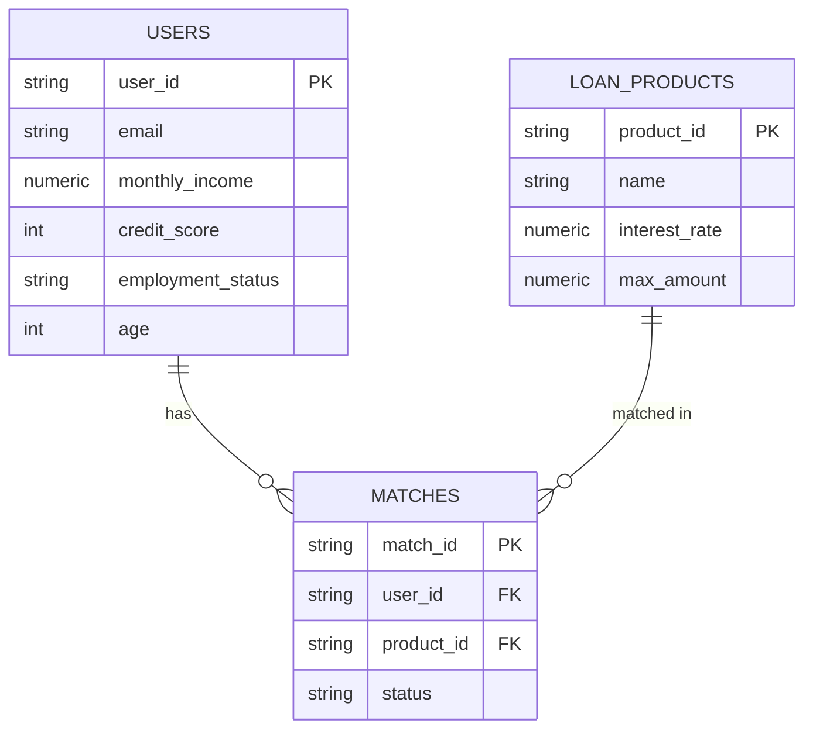

<div align="center">

# 🏦 Loan Eligibility Engine

**An event-driven, serverless AWS pipeline that automates loan eligibility processing end-to-end.**


</div>

---

## 📖 Table of Contents

- [Overview](#-overview)
- [Problem Statement](#-problem-statement)
- [Features](#-features)
- [Architecture](#-architecture)
- [Tech Stack](#-tech-stack)
- [System Workflow](#-system-workflow)
- [AWS Infrastructure](#-aws-infrastructure)
- [Database Schema](#-database-schema)
- [CSV Format](#-csv-format)
- [Folder Structure](#-folder-structure)
- [Getting Started](#-getting-started)
  - [Local Setup](#local-setup)
  - [Docker Setup](#docker-setup)
  - [AWS Deployment](#aws-deployment)
- [Environment Variables](#-environment-variables)
- [Component Deep Dive](#-component-deep-dive)
- [Security](#-security)
- [Monitoring](#-monitoring)
- [Troubleshooting](#-troubleshooting)
- [Engineering Challenges](#-engineering-challenges)
- [Future Improvements](#-future-improvements)
- [Contributing](#-contributing)
- [License](#-license)

---

## 🔎 Overview

**Loan Eligibility Engine** replaces a manual, spreadsheet-driven loan intake process with a fully automated, event-driven pipeline on AWS. A user uploads a CSV of customer applications to S3; from there, the system takes over — validating the data, persisting it to PostgreSQL, triggering workflow automation in n8n, matching each applicant against loan products, and notifying users of the outcome — with no manual intervention.

## ❗ Problem Statement

Financial institutions process large volumes of loan applications, and manual verification is:

- **Slow** — every application requires manual review
- **Error-prone** — human data entry and eligibility checks introduce mistakes
- **Hard to scale** — throughput is capped by headcount, not infrastructure

This project addresses all three by moving the entire workflow onto serverless, event-driven infrastructure that scales automatically with load and removes manual steps from the critical path.

## ✨ Features

- 📤 CSV-based bulk application intake via S3 upload
- ⚡ Automatic, event-triggered processing — no polling, no manual runs
- ✅ Input validation before any data is persisted
- 🗄️ Durable storage of applicants, products, and match results in PostgreSQL
- 🔁 Workflow automation and eligibility evaluation via n8n
- 📧 Automated applicant notifications
- 🔒 Network-isolated, least-privilege AWS architecture

## 🏗️ Architecture



## 🧰 Tech Stack

| Layer | Technology |
|---|---|
| **Backend** | Python |
| **Compute** | AWS Lambda |
| **Storage** | Amazon S3 |
| **Database** | PostgreSQL (Amazon RDS) |
| **Workflow Automation** | n8n |
| **Networking** | VPC, Public/Private Subnets, Route Tables, Internet Gateway, NAT Gateway, Security Groups, IAM |
| **Monitoring** | Amazon CloudWatch Logs |
| **Local Development** | Docker, Docker Compose, ngrok, Git/GitHub |

## 🔄 System Workflow



## ☁️ AWS Infrastructure

<details>
<summary><strong>Click to expand infrastructure details</strong></summary>

| Component | Responsibility |
|---|---|
| **Amazon S3** | Stores uploaded CSV files; triggers Lambda automatically on upload |
| **AWS Lambda** | Serverless compute that processes each uploaded CSV |
| **Amazon RDS (PostgreSQL)** | Stores users, loan products, and matches |
| **IAM Role** | Grants Lambda least-privilege permissions to S3, RDS, and CloudWatch |
| **CloudWatch** | Captures Lambda execution logs for monitoring and debugging |
| **VPC** | Provides an isolated network boundary for Lambda and RDS |
| **Private Subnets** | Host RDS and Lambda so they communicate without public exposure |
| **Public Subnet** | Hosts the NAT Gateway |
| **NAT Gateway** | Lets Lambda in a private subnet reach the internet for outbound calls (e.g., the n8n webhook) |
| **Internet Gateway** | Provides internet connectivity to the public subnet |
| **Security Groups** | Control traffic between Lambda and PostgreSQL |
| **Route Tables** | Manage routing between subnets, NAT, and the Internet Gateway |

</details>

## 🗄️ Database Schema



| Table | Purpose |
|---|---|
| `users` | Stores uploaded customer records from the CSV |
| `loan_products` | Stores available loan offerings |
| `matches` | Stores which users were matched to which loan products |

## 📋 CSV Format

Uploaded CSV files must contain the following columns:

| Column | Description |
|---|---|
| `user_id` | Unique identifier for the applicant |
| `email` | Applicant's email address |
| `monthly_income` | Applicant's monthly income |
| `credit_score` | Applicant's credit score |
| `employment_status` | Applicant's current employment status |
| `age` | Applicant's age |

## 📁 Folder Structure

```
loan-eligibility-engine/
├── backend/
│   └── lambda/          # CSV processor Lambda source
├── database/             # Schema + migrations
├── docker/                # Dockerfiles + Compose configs
├── n8n/                   # n8n workflow exports
├── docs/                  # Extended documentation
└── README.md
```

## 🚀 Getting Started

### Local Setup

```bash
git clone https://github.com/Rakesh-honawad/loan-eligibility-engine.git
cd loan-eligibility-engine
pip install -r requirements.txt
```

### Docker Setup

```bash
docker-compose up -d
```

This spins up PostgreSQL, n8n, and supporting services locally. Use **ngrok** to expose your local n8n webhook so S3/Lambda (or a local test harness) can reach it during development.

### AWS Deployment

Core resources to provision:

1. S3 bucket with an event notification configured to invoke the Lambda
2. Lambda function (Python) with a VPC configuration attached
3. RDS PostgreSQL instance in a private subnet
4. IAM execution role with least-privilege permissions (S3 read, RDS access, CloudWatch write, plus `ec2:CreateNetworkInterface`/`DescribeNetworkInterfaces`/`DeleteNetworkInterface` for VPC-attached Lambdas)
5. VPC with public + private subnets, an Internet Gateway, a NAT Gateway, and appropriate Route Tables
6. Security Groups restricting Lambda ↔ RDS traffic to the required port only

## 🔧 Environment Variables

| Variable | Description |
|---|---|
| `DB_HOST` | PostgreSQL host |
| `DB_PORT` | PostgreSQL port |
| `DB_NAME` | Database name |
| `DB_USER` | Database user |
| `DB_PASSWORD` | Database password |
| `AWS_REGION` | AWS region for deployed resources |
| `S3_BUCKET` | Bucket name for CSV uploads |
| `N8N_WEBHOOK_URL` | Webhook URL that triggers the n8n workflow |
| `GOOGLE_GEMINI_API_KEY` | API key for Gemini integration |

> Never commit real values — use a `.env` file locally (gitignored) and AWS Secrets Manager / environment configuration in production.

## 🧩 Component Deep Dive

**AWS Lambda (CSV Processor)**
Downloads the uploaded CSV from S3, validates required columns and data types, parses records, connects to PostgreSQL, inserts users, triggers the n8n webhook, logs every step to CloudWatch, and returns a success/error result.

**n8n Workflow**
Receives the webhook from Lambda, reads the newly inserted user records, evaluates loan eligibility, matches eligible users against loan products, stores the resulting matches, and triggers the notification workflow.

**Database (PostgreSQL)**
Central store of truth for `users`, `loan_products`, and `matches`, queried by both the Lambda and the n8n workflow.

## 🔒 Security

- Least-privilege IAM roles for Lambda
- RDS deployed in a private subnet, not publicly reachable
- Security Groups restrict traffic to only what's required between Lambda and RDS
- Full VPC network isolation
- Secrets/config passed via environment variables, not hardcoded
- Serverless architecture reduces persistent attack surface

## 📊 Monitoring

All Lambda execution logs — including validation failures, DB connection issues, and webhook trigger results — are captured in **Amazon CloudWatch Logs** for debugging and auditability.

## 🛠️ Troubleshooting

| Symptom | Likely Cause | Fix |
|---|---|---|
| Lambda can't reach RDS | Security Group not allowing Lambda ↔ RDS traffic | Add an inbound rule on the RDS Security Group allowing traffic from the Lambda's Security Group |
| Lambda can't reach the n8n webhook | Lambda in a private subnet with no outbound internet path | Verify a NAT Gateway is attached and Route Tables direct 0.0.0.0/0 traffic through it |
| `CreateNetworkInterface` permission error | Lambda execution role missing VPC-related EC2 permissions | Attach `AWSLambdaVPCAccessExecutionRole` (or equivalent custom policy) to the execution role |
| PostgreSQL authentication failure | Wrong credentials or DB not yet created | Confirm `DB_USER`/`DB_PASSWORD` match the RDS instance and the target database exists |
| Works locally, fails on AWS | Local Docker Postgres vs. RDS config drift | Confirm environment variables point to RDS, not `localhost`, in the deployed environment |

## 🧗 Engineering Challenges

> The table below lists the real issues encountered during development. Descriptions are written generically — swap in your own specifics (error messages, exact fixes, timings) so this section reflects what you actually debugged and can speak to in an interview.

| Challenge | Area |
|---|---|
| Lambda `CreateNetworkInterface` permission error | IAM / VPC networking |
| IAM execution role configuration | IAM |
| Lambda timeout | Lambda configuration |
| VPC networking setup | Networking |
| Route Table configuration | Networking |
| NAT Gateway configuration | Networking |
| Security Group rules | Networking |
| RDS connectivity | Database |
| PostgreSQL authentication | Database |
| Incorrect environment variables | Configuration |
| Local Docker DB vs. AWS RDS confusion | Configuration |
| Database creation | Database |
| CloudWatch debugging workflow | Observability |
| Lambda retry behavior | Lambda configuration |

## 🔮 Future Improvements

- [ ] Add automated tests for the Lambda validation logic
- [ ] Add a dead-letter queue for failed Lambda invocations
- [ ] Expand the n8n workflow with richer eligibility rules
- [ ] Add an API layer for querying match results directly

## 🤝 Contributing

Contributions are welcome. Please open an issue to discuss a change before submitting a pull request.

## 📄 License

This project is licensed under the MIT License.
